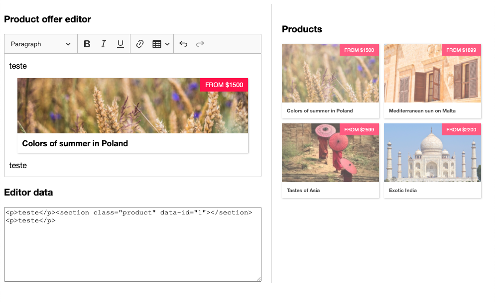

# CKEditor5 React

Using a React component in a block widget

### Demo

https://ckeditor-products.netlify.app/

### Preview

### Reference

https://github.com/ckeditor/ckeditor5/blob/master/docs/framework/guides/tutorials/using-react-in-a-widget.md#using-a-react-component-in-a-block-widget
